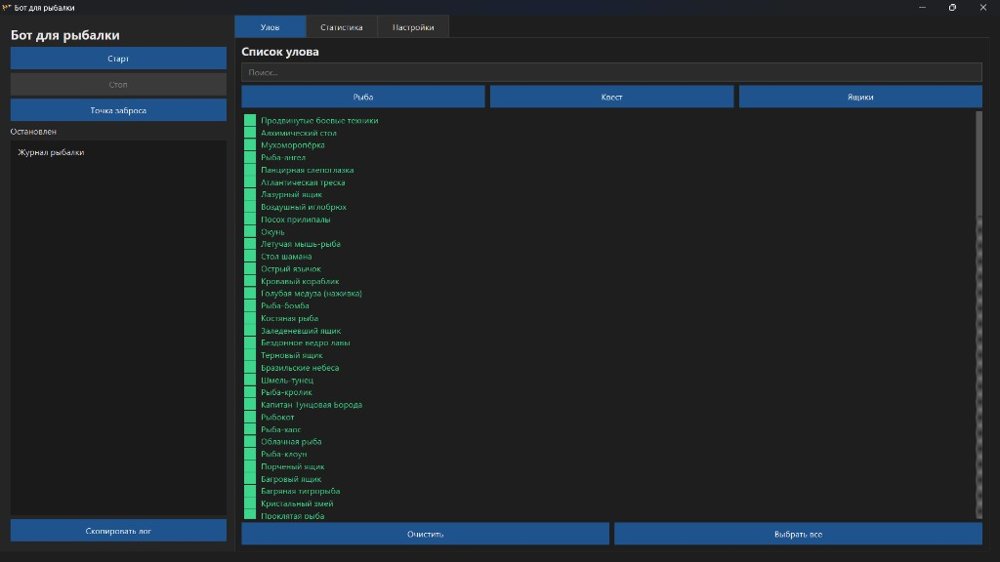
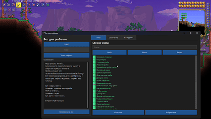

**English** · [Русский](README.ru.md)

# Terraria Fishing Bot

Memory-based fishing helper for Terraria **1.4.5.8** on Windows. It reads the live `Terraria.exe` process and left-clicks at a saved cast point when a whitelisted bite appears. **It does not patch the game.**

Use the default **32-bit Steam** build. Do not add `-autoarch` (that starts 64-bit Terraria; the bot will refuse to attach).





## Warning

If FPS dips, a recast click can miss a frame. The bot waits about a second for the bobber and will not click again if one is already out.

The game cannot run in the background: a click always brings Terraria back as the active application. There is no adequate alternative for running the game in the background with the bot.

## Download / Run

1. Download the zip from [GitHub Releases](https://github.com/Shtirlyts/Terraria-Fishing-Bot/releases).
2. Extract the **whole** folder. You need both `Fishing bot.exe` and `_internal\`.
3. Double-click `Fishing bot.exe`. Do not move the exe out of that folder.

The exe does not work without `_internal` next to it. Preferences and statistics (`preferences.json`, `statistics.json`) are stored next to the exe.

Running from source is optional — see [From source](#from-source-optional).

## How to use

1. Launch **32-bit** Terraria, enter a world, equip a fishing rod.
2. Run `Fishing bot.exe` from the extracted folder (keep `_internal` next to it).
3. Open the **Catch** tab. Tick items, use presets (Fish / Quest / Crates), or **Select All**. Start needs a non-empty list.
4. Click **Start**. Wait until the log says the hook was found.
5. Aim at the water in Terraria and **cast once**. The bot stores that point. **Cast point** clears it so you can set it again.
6. Leave Terraria in the foreground. The cursor will move to the saved point on each reel/recast. Run Terraria and the bot at the **same privilege level** (both as a normal user, or both as administrator). Otherwise Windows can block `SendInput` while memory reads still work.
7. **Stop** ends the hook.

Language, theme, window mode, auto-drink, and the Quick Buff key are on the **Settings** tab.

### Known limitation

Reel retries until `itemAnimation` starts (the first click often misses). Recast is a **single** click: a fishing cast does not raise `itemAnimation`, and a second click would reel the line back. If the log shows reel/focus failures, check the cast point and that the game and bot share the same privilege level.

## Stack

| Layer | What |
|--------|------|
| Python 3.11 | Runtime |
| PySide6 + pywin32 | Window, tabs, language, `SendInput` mouse clicks |
| pymem + `ReadProcessMemory` / `WriteProcessMemory` | Attach to `Terraria.exe`, scan JIT, read/write fields |
| PyInstaller | Onedir bundle: `Fishing bot.exe` + `_internal\` |

## What does what

| Path | Role |
|------|------|
| [`src/Fishing bot.py`](src/Fishing%20bot.py) | Entry: load prefs/stats, start the Qt app |
| [`src/gui/`](src/gui/) | PySide6 GUI: Start / Stop / Cast point, catch list, statistics, settings |
| [`src/memory_bot.py`](src/memory_bot.py) | JIT scan for `FishingCheck`, read `rolledItemDrop`, save aim, click to reel/recast |
| [`src/projectile_probe.py`](src/projectile_probe.py) | Optional debug log (`projectile_probe.jsonl`) |
| [`src/icon.ico`](src/icon.ico) | Window and exe icon (pixel phoenix / flame) |
| [`src/data/catches.json`](src/data/catches.json) | Terraria item IDs and names |
| [`src/locale/`](src/locale/) | UI strings (en / ru) |
| `preferences.json` | Next to the exe (or in `src/` from source): catch list, language, theme, saved cast point |
| `statistics.json` | Next to the exe (or in `src/` from source): catch counts |

Flow:

```
Start → attach to Terraria.exe
  → scan JIT for FishingCheck → Projectile._context.FishingAttempt.rolledItemDrop
  → user casts once → cursor position saved (client coordinates)
  → whitelist bite → short left-click at that point (reel, then recast)
Log + statistics.json
```

## Build

```powershell
powershell -ExecutionPolicy Bypass -File scripts/build.ps1
```

Output: `release\Fishing bot.exe` plus `release\_internal\`. Close any running bot first so `_internal` is not locked.

### From source (optional)

```powershell
pip install -r requirements.txt
python "src/Fishing bot.py"
```

`Fishing bot.bat` is a fallback: it starts `release\Fishing bot.exe` if present, otherwise `pythonw`.

### GitHub Releases

Push a tag `v*` (e.g. `v0.4.0`). Workflow [`.github/workflows/release.yml`](.github/workflows/release.yml) builds the Windows zip.

```powershell
git tag v0.4.0
git push origin v0.4.0
```

## License

MIT — see [LICENSE](LICENSE).
