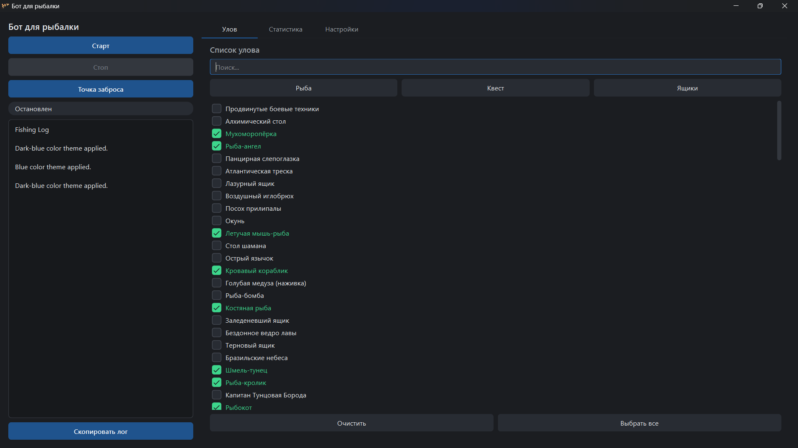

[English](README.md) · **Русский**

# Terraria Fishing Bot

Помощник для рыбалки в Terraria **1.4.5.8** на Windows. Читает процесс `Terraria.exe` и кликает ЛКМ в сохранённую точку заброса, когда на крючке предмет из списка. **Игру не патчит.**

Нужна обычная **32-битная Steam**-сборка. Не добавляйте `-autoarch` (запустится 64-битная Terraria; бот к ней не подключится).




## Требования и ограничения

Бот поддерживает только **мультиплеер**. Одиночная игра не поддерживается.

Terraria должна оставаться видимой и активной. По умолчанию при свёрнутой или неактивной игре бот остановится без клика. Опция **«Разворачивать Terraria перед забросом»** разрешает восстановление только свёрнутого окна; обычное неактивное окно она не активирует.

Заброс — одно физическое нажатие ЛКМ, удерживаемое ровно одно обнаруженное обновление игры. Это исключает как слишком короткий пропущенный клик, так и второй use, который вернул бы свежий поплавок; длительность зависит от частоты обновления игры, а не от таймера Windows.

## Скачать / запуск

1. Скачайте zip из [GitHub Releases](https://github.com/Shtirlyts/Terraria-Fishing-Bot/releases).
2. Распакуйте **всю** папку: нужны и `Fishing bot.exe`, и `_internal\`.
3. Запустите `Fishing bot.exe`. Не вытаскивайте exe из этой папки.

Без `_internal` рядом с exe бот не работает. `preferences.json` и `statistics.json` пишутся рядом с exe.

Запуск из исходников — по желанию, см. [Из исходников](#из-исходников-по-желанию).

## Как пользоваться

1. Запустите **32-битную** Terraria, зайдите в мир, возьмите удочку.
2. Запустите `Fishing bot.exe` из распакованной папки (`_internal` должна лежать рядом).
3. Вкладка **Улов**. Галочки, пресеты (Рыба / Квест / Ящики) или **Выбрать все**. Для старта список не должен быть пустым.
4. Нажмите **Старт**. Дождитесь в логе, что хук найден.
5. Наведите курсор на воду в Terraria и **забросьте один раз**. Бот запомнит точку. Кнопка **Точка заброса** сбрасывает её, чтобы задать заново.
6. Держите игру видимой и на переднем плане. По умолчанию бот остановится, но не будет разворачивать свёрнутое окно или кликать в неактивную игру. Опция **«Разворачивать Terraria перед забросом»** меняет только поведение для свёрнутого окна. Курсор будет уезжать в сохранённую точку на каждой подсечке и забросе. Terraria и бот должны быть с **одним уровнем прав** (оба обычные или оба «от администратора»). Иначе Windows может резать `SendInput`, а чтение памяти продолжит работать.
7. **Стоп** снимает хук.

Язык, тема, режим окна, авто-зелье и клавиша Quick Buff — вкладка **Настройки**.

### Безопасность ввода

Подсечка повторяет клик, пока не поднимется `itemAnimation` (первый клик может не пройти). Заброс — **одно** нажатие: заброс удочки не поднимает `itemAnimation`, а повтор снял бы леску. Если рыбалка остановилась, проверьте, что Terraria активна, точка заброса верна, а игра и бот запущены с одним уровнем прав.

## Стек

| Слой | Зачем |
|------|--------|
| Python 3.11 | Среда выполнения |
| PySide6 + pywin32 | Окно, вкладки, язык, клики мыши через `SendInput` |
| pymem + `ReadProcessMemory` / `WriteProcessMemory` | Подключение к `Terraria.exe`, скан JIT, чтение и запись полей |
| PyInstaller | Сборка onedir: `Fishing bot.exe` + `_internal\` |

## Кто за что отвечает

| Путь | Роль |
|------|------|
| [`src/Fishing bot.py`](src/Fishing%20bot.py) | Точка входа: prefs/stats, запуск Qt |
| [`src/gui/`](src/gui/) | GUI на PySide6: Старт / Стоп / Точка заброса, список улова, статистика, настройки |
| [`src/memory_bot.py`](src/memory_bot.py) | Скан JIT `FishingCheck`, определение нырка поплавка, точка прицела, клик (подсечка / заброс) |
| [`src/projectile_probe.py`](src/projectile_probe.py) | Необязательный отладочный лог (`projectile_probe.jsonl`) |
| [`src/icon.ico`](src/icon.ico) | Иконка окна и exe (пиксельный феникс / пламя) |
| [`src/data/catches.json`](src/data/catches.json) | ID и имена предметов Terraria |
| [`src/locale/`](src/locale/) | Строки интерфейса (en / ru) |
| `preferences.json` | Рядом с exe (или в `src/` при запуске из исходников): список улова, язык, тема, точка заброса |
| `statistics.json` | Рядом с exe (или в `src/` при запуске из исходников): счётчики улова |

Цепочка:

```
Старт → подключение к Terraria.exe
  → скан JIT FishingCheck → определение нырка локального поплавка
  → один заброс игроком → позиция курсора сохраняется (клиентские координаты)
  → улов из списка → клик ЛКМ в эту точку (подсечка, затем заброс на одно обновление)
Лог + statistics.json
```

## Сборка

```powershell
powershell -ExecutionPolicy Bypass -File scripts/build.ps1
```

Результат: `release\Fishing bot.exe` и `release\_internal\`. Сначала закройте бота, иначе `_internal` может быть занят.

### Из исходников (по желанию)

```powershell
pip install -r requirements.txt
python "src/Fishing bot.py"
```

`Fishing bot.bat` — запасной вариант: запускает `release\Fishing bot.exe`, если он есть, иначе `pythonw`.

### GitHub Releases

Пуш тега `v*` (например `v0.4.0`). Workflow [`.github/workflows/release.yml`](.github/workflows/release.yml) собирает Windows zip.

```powershell
git tag v0.4.0
git push origin v0.4.0
```

## Лицензия

MIT — см. [LICENSE](LICENSE).
